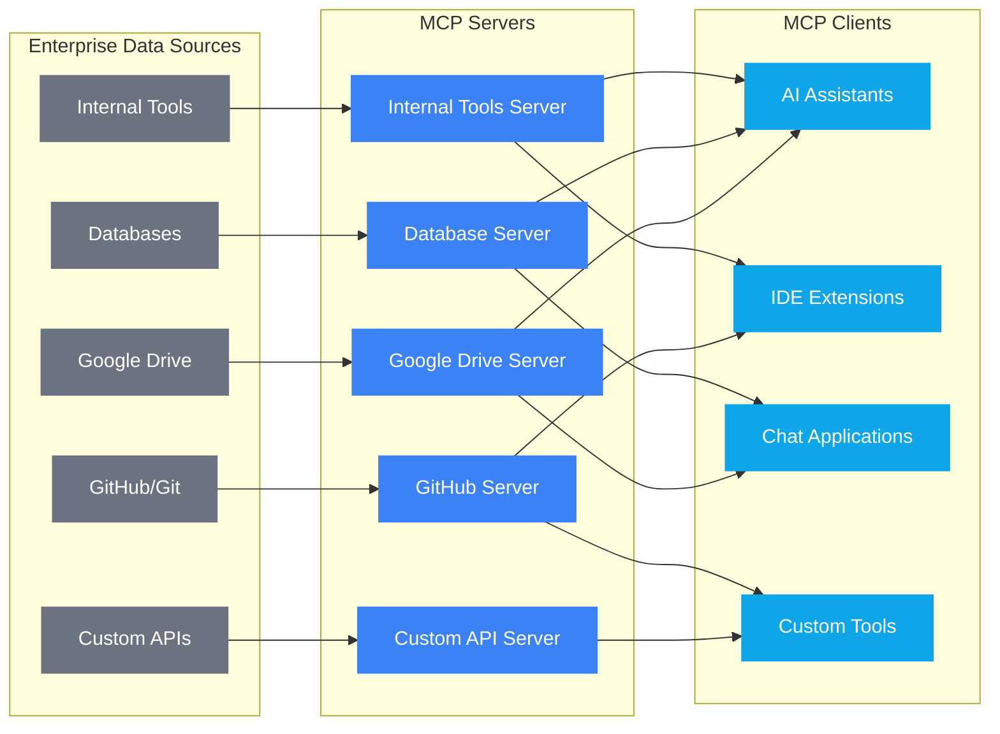
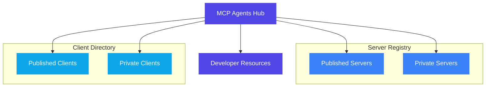

# MCP Agents Hub

The open-source ecosystem for building, discovering, and deploying Model Context Protocol servers and clients for enterprise environments.

## What is the Model Context Protocol?

The Model Context Protocol (MCP) is an open standard that enables developers to build secure, two-way connections between their data sources and AI-powered tools. The architecture is straightforward: developers can either expose their data through MCP servers or build AI applications (MCP clients) that connect to these servers.

With MCP, AI systems can maintain context as they move between different tools and datasets, replacing today's fragmented integrations with a more sustainable architecture.

### Key Components
- **MCP Specification**: The open standard protocol definition that enables interoperability between servers and clients
- **MCP Servers**: Custom-built connectors that expose data sources, tools, and APIs to AI applications
- **MCP Clients**: AI-powered applications that connect to MCP servers to access contextual data and functionality

### MCP Servers and Clients Relationship



## Why MCP Agents Hub?

As the MCP ecosystem expands, organizations need a central hub to manage, discover, and share MCP resources. This marketplace serves as that hub, enabling enterprises to:
- Discover pre-built MCP servers for common enterprise systems
- Share custom MCP servers developed within their organization
- Learn best practices for building effective MCP connectors
- Deploy the entire marketplace on-premise for security and governance

### MCP Agents Hub Ecosystem



## Features

- **Server Building**: Templates, examples, and best practices to accelerate MCP server development
- **Client Development**: Build AI applications that leverage the MCP protocol with standardized interfaces
- **Tool Discovery**: Find pre-built MCP servers for popular enterprise systems (Google Drive, Slack, GitHub, Git, Postgres, etc.)
- **Enterprise-Ready Deployment**: Deploy on-premise for enhanced security and compliance

## Technology Stack
- TypeScript
- React
- Vite
- Tailwind CSS
- Lucide React (for icons)

## Installation
1. Clone the repository
2. Run `npm install` to install dependencies
3. Start the development server with `npm run dev`

## Available Scripts
- `dev`: Start development server
- `build`: Build for production
- `preview`: Preview production build
- `lint`: Run ESLint
- `type-check`: Run TypeScript type checking

### Server Data Processing Scripts
The server includes several data processing scripts that can be run with npm:

- `crawl-servers`: Crawls the MCP servers directory from the main repository
- `update-server-types`: Updates server type information from crawling results
- `clean-duplicates`: Cleans duplicate entries in the data
- `process_categories`: Processes and organizes categories data
- `process_locales`: Processes locale translations for internationalization

#### Running Background Processes
For long-running data processing tasks, you can use nohup to run them in the background:

```bash
# Run process_locales in the background with output to a log file
cd server && nohup npm run process_locales > process_locales.log 2>&1 &

# Check if the process is running
ps aux | grep "process_locales" | grep -v grep

# View the log output
tail -f process_locales.log

# Stop the process (replace PID with the actual process ID from ps command)
kill <PID>
```

## Community

Join the open community to build the future of context-aware AI together. Whether you're an AI tool developer, an enterprise looking to leverage existing data, or an early adopter exploring the frontier, we invite you to contribute.

- MCP: [https://github.com/modelcontextprotocol](https://github.com/modelcontextprotocol)
- MCP Agents Hub [https://github.com/mcp-agents-ai/mcp-agents-hub](https://github.com/mcp-agents-ai/mcp-agents-hub)

## License

This project is licensed under the Apache License, Version 2.0. See the [LICENSE](LICENSE) file for details.
